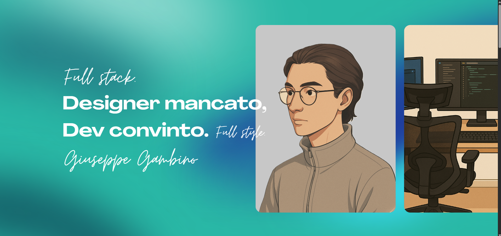

# 🌐 Portfolio Personale – [Giuseppe Gambino]

Benvenuto nel repository del mio **portfolio personale**!  
Questo sito rappresenta il mio spazio online come **junior frontend developer** con basi full stack, dove condivido i miei progetti, la mia esperienza e la mia crescita nel mondo dello sviluppo web.

---

## 🔗 Live Demo

👉 [Visita il mio portfolio](https://share.google/vEeMbz5dmaH9pqGFo)  

---

## 📌 Cosa troverete

- Una selezione dei miei progetti personali e real-world
- Una breve presentazione di me, delle mie competenze e dei miei obiettivi
- UI custom, micro-animazioni fluide, attenzione al design
- Un sito moderno e veloce, realizzato con passione

---

## 🧰 Tech Stack

- **Framework:** Angular
- **Styling:** TailwindCSS, SCSS
- **Animazioni:** GSAP, Lenis (smooth scroll)
- **Tooling:** Angular CLI
- **Responsive:** Mobile e desktop già funzionanti, work in progress su alcuni breakpoint

---

## 📸 Screenshot

